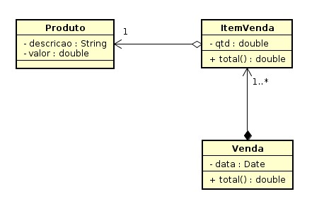

#  PW2 Sistemas de Vendas

## Atividade 1

Com JPA você aprendeu que podemos gerar nossas tabelas no banco de dados usando anotações. Deste modo, crie um novo projeto e crie entidades conforme diagrama de classe a seguir.



Você deve:

* Definir os **relacionamento das associações entre as classes** usando as anotações JPA. :white_check_mark:

conforme instruções do material em [https://fagno.github.io/pwebii-spring-ifto/jpa/#_mapeamento_com_associa%C3%A7%C3%B5es](https://fagno.github.io/pwebii-spring-ifto/jpa/#_mapeamento_com_associações).

**Você deve inserir os dados do(s) produto(s) e venda(s) diretamente no banco.**

Não é necessário criar a interface web completa do projeto, você deve apenas: 

* Criar **list.html** de **Venda** e apresentar os seguintes dados (**ID,** **DATA** E **TOTAL**) da(s) venda(s). :white_check_mark:
* Crie o Repository e Controller de **Venda** para apresentar os dados solicitados. :white_check_mark:

## Atividade 2

Nesta tarefa, você deve complementar o projeto da [Mapeamento com associações usando JPA](https://moodlepalmas.ifto.edu.br/moodle/mod/assign/view.php?id=63417) e criar o carrinho de compras.

**NOTAS:**

* Alterar a associação entre **ItemVenda** e **Venda** para navegabilidade bidirecional; :white_check_mark:

* Criar **FORM de cadastro** e apresentar **lista de produtos**; :white_check_mark:

* Criar **FORM de venda**, na qual, deve permitir selecionar o itens que deseja comprar, informar quantidade e finalizar venda; :white_check_mark:

* Por fim, criar **view** para apresentar lista de vendas (já feito na tarefa anterior). :white_check_mark:

## Atividade 3

Nesta tarefa, você deve complementar o projeto Carrinho de Compras, conforme a seguir.

* incluir o BootStrap (https://getbootstrap.com/) no seu projeto, dependência a seguir. :white_check_mark:

* incluir as views header e footer (disponível anexo a tarefa) usando fragments do Spring. :white_check_mark:

Ao incluir os arquivos header.html e footer.html (modelo a ser utilizado), faça o insert nas outras páginas HTML. Para incluir o cabeçalho e rodapé basta inserir a linha de código a seguir na sua página. NOTA: O código disponível no header e footer não precisar ser repetido nas suas views.

Para header (NOTA: Incluir NavBar no Header):

```html
<div th:insert="fragments/header :: modelheader"></div>
````

Para footer:

```html
<div th:insert="fragments/footer :: modelfooter"></div>
````

*  criar view home.html para seu projeto e utilizar a classe ConfiguracaoSpringMvc.java anexo a atividade para carregar a mesma. :white_check_mark:


## Atividade 4

Nesta tarefa, você deve complementar o projeto CARRINHO DE COMPRAS e incluir a entidade Cliente na associação.

NOTAS: 

1) Utilizar o mapeamento de herança que você utilizou em tarefa anterior ou outra de sua preferência; :white_check_mark:

* Cliente (id) :white_check_mark:
* ClientePF (nome, cpf), subclasse de Cliente. :white_check_mark:

2) Incluir o cadastro de cliente com CRUD; :white_check_mark:

3) Um cliente pode ter várias compras e uma compra só pode ter um cliente; :white_check_mark:

4) Ao efetuar uma venda o sistema deve permitir selecionar o cliente. :white_check_mark:

## Atividade 5

Nesta tarefa, você deve complementar o projeto CARRINHO DE COMPRAS e incluir as validações necessárias no Back-end do projeto.

Como requisito da atividade, você deve definir validações para cadastro de produtos, clientes e vendas. :white_check_mark:

## Atividade 6

O HQL é uma linguagem do Hibernate semelhante ao SQL, que não realiza operações nas tabelas e colunas do banco de dados, ele trabalha com objetos persistentes e suas propriedades, ou seja, classes e propriedades das classes.

O HQL inspirou a criação da JPQL (Java Persistence Query Language) que faz parte da especificação oficial da JPA.

Material complementar: [https://docs.jboss.org/hibernate/orm/3.5/reference/pt-BR/html/queryhql.html#queryhql-where](https://docs.jboss.org/hibernate/orm/3.5/reference/pt-BR/html/queryhql.html#queryhql-where)

Nesta tarefa, você deve complementar o projeto CARRINHO DE COMPRAS incluindo:

* Na lista de vendas "detalhes" da compra, consulta que vai apresentar todos as informações da referida compra. :white_check_mark:
* Na lista de vendas, a consulta deve apresentar apenas ( ID, DATA, CLIENTE, TOTAL ). :white_check_mark:

Da mesma forma, na consulta de CLIENTES, a funcionalidade deve ser a mesma.

* Na consulta de CLIENTES crie um campo texto para filtrar CLIENTE por nome. :white_check_mark:
* Na consulta de VENDAS crie a possibilidade de filtrar VENDAS por data. :white_check_mark:

## Atividade 7

Após adicionar o Spring Security no seu projeto  :white_check_mark:

 * Crie um form de login personalizado de sua preferência ou utilize o modelo disponível em login.html. :white_check_mark:
 
Siga as instruções da aula VIDEO para desenvolver a atividade.

## Atividade 8

Complemente o projeto CARRINHO DE COMPRAS incluindo o controle de acesso com Spring Security conforme vídeo da aula. 

Você deve definir o controle de acesso de acordo ao perfil de usuário adequado para seu projeto.  :white_check_mark: