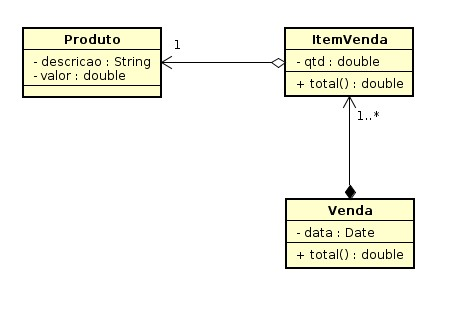

#  PW2 Sistemas de Vendas

Com JPA você aprendeu que podemos gerar nossas tabelas no banco de dados usando anotações. Deste modo, crie um novo projeto e crie entidades conforme diagrama de classe a seguir.

Você deve definir os relacionamento das associações entre as classes usando as anotações JPA conforme instruções do material em [https://fagno.github.io/pwebii-spring-ifto/jpa/#_mapeamento_com_associa%C3%A7%C3%B5es](https://fagno.github.io/pwebii-spring-ifto/jpa/#_mapeamento_com_associações).

**Você deve inserir os dados do(s) produto(s) e venda(s) diretamente no banco.**

Não é necessário criar a interface web completa do projeto, você deve apenas criar o **list.html** de **Venda** e apresentar os seguintes dados (**ID,** **DATA E** **TOTAL)** da(s) venda(s). Crie o Repository e Controller de **Venda** para apresentar os dados solicitados.




Primeiro Insira os dados na tabela **tb_produtos**

````mysql
INSERT INTO tb_produtos VALUES
(1, 'Smartphone Moto G9', 1099.99), 
(2, 'Smartwatch Xiaomi Mi Band 5', 218.50),
(3, 'Redmi AirDots 3 Xiaomi', 169.99),
(4, 'Iphone 11 128 GB Branco', 5040.99);
````

Depois insira dados na tabela **tb_venda**

````mysql
INSERT INTO tb_venda VALUES (1, '5/1/2019', 1099.99); 

INSERT INTO tb_venda VALUES (2, '11/10/2020', 1488.48);
````

e depois na tabela **tb_itemvenda**

````mysql
INSERT INTO tb_itemvenda VALUES (1, 1, 1099.99, 1, 1);

INSERT INTO tb_itemvenda VALUES (2, 1, 1099.99, 1, 2);
INSERT INTO tb_itemvenda VALUES (3, 1, 169.99, 3, 2);
INSERT INTO tb_itemvenda VALUES (4, 1, 218.50, 2, 2);
````


(**obs:** pode inserir dados na tabela **tb_itemvenda** antes da  tabela **tb_venda**, só não inserir dados na coluna **id_venda** )

````mysql
INSERT INTO tb_itemvenda (id_item, quantidade, id_produto) VALUES (1, 1, 1);
````

e depois q inserir os dados na tabela **tb_venda**, faça um update na tabela **tb_itemvenda**:

````mysql
UPDATE tb_itemvenda SET id_venda = 1 WHERE id_item = 1;
````